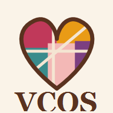

# VCOS

<p align="center">
  
  
</p>

<p align="center">
  <strong>Aplicativo Flutter para gestao simples de vendas, gastos e resultados de um atelie artesanal.</strong>
</p>

<p align="center">
  
  
  
</p>

## Sobre o Projeto

O **VCOS** centraliza a rotina financeira de um atelie em uma experiencia mobile limpa, acessivel e preparada para funcionar offline. A proposta e permitir que a artesa registre vendas, acompanhe gastos, visualize indicadores e mantenha dados essenciais do negocio mesmo antes da integracao definitiva com uma API.

## Imagens do Projeto

Os icones abaixo fazem parte do pacote web do aplicativo e representam a identidade visual usada no projeto.

| Icone principal | Icone PWA | Icone maskable |
| --- | --- | --- |
|  |  |  |

> Para screenshots de telas, recomenda-se salvar novas imagens em `docs/images/` e referencia-las neste README usando caminhos relativos, por exemplo: `docs/images/home.png`.

## Funcionalidades

- **Inicio:** resumo financeiro do atelie com saldo, total de vendas, total de gastos e status de sincronizacao.
- **Vendas:** cadastro, edicao e exclusao logica de vendas, com cliente, valor, data e sugestoes de preenchimento.
- **Gastos:** cadastro, edicao, exclusao logica e visualizacao detalhada de despesas, incluindo suporte a fotos.
- **Relatorios:** visao consolidada de entradas, saidas, saldo e proporcao dos gastos sobre as vendas.
- **Configuracoes:** dados do atelie, responsavel, telefone, sincronizacao automatica e preferencia de alto contraste.
- **Offline-first:** persistencia local com `sqflite` e fila de sincronizacao para integracao futura.

## Stack

- **Flutter / Dart** para aplicacao multiplataforma.
- **Provider** para gerenciamento de estado.
- **sqflite** para armazenamento local.
- **intl** para formatacao.
- **image_picker** para anexos de imagens.
- **pdf**, **printing** e **share_plus** para evolucao de exportacao e compartilhamento.
- **flutter_test** e **integration_test** para testes automatizados.

## Estrutura

```text
lib/
  app/
    vcos_app.dart
  core/
    data/
    models/
    state/
    sync/
    theme/
    widgets/
  features/
    expenses/
    home/
    reports/
    sales/
    settings/
    shared/
    shell/
test/
integration_test/
web/
android/
```

## Como Rodar

Instale as dependencias:

```bash
flutter pub get
```

Execute o app:

```bash
flutter run
```

Execute os testes:

```bash
flutter test
```

Analise o codigo:

```bash
flutter analyze
```

## Fluxo de Desenvolvimento

Crie uma branch a partir da branch principal antes de iniciar qualquer alteracao:

```bash
git checkout main
git pull
git checkout -b feature/nome-da-funcionalidade
```

Mantenha commits pequenos, objetivos e relacionados a uma unica mudanca. Antes de abrir um pull request, rode:

```bash
flutter analyze
flutter test
```

## Padrao de Branches e Commits

Use os prefixos abaixo para organizar branches e commits. O nome deve ser curto, em minusculo e separado por hifen.

### Features

```text
feature/login
feature/dashboard
feature/usuarios
```

### Fixes

```text
fix/correcao-api
fix/correcao-validacao
```

### Hotfixes

```text
hotfix/crash-android
```

### Refactors

```text
refactor/camada-dados
refactor/repositorios
```

### Documentacao

```text
docs/readme-inicial
```

Exemplos de commits seguindo o mesmo padrao:

```bash
git commit -m "feature/dashboard: adiciona cards de resumo"
git commit -m "fix/correcao-validacao: ajusta validacao de valores"
git commit -m "docs/readme-inicial: documenta fluxo de releases"
```

## Tags do GitHub

As tags devem marcar pontos estaveis do projeto e seguir versionamento semantico:

```text
v0.1.0
v0.2.0
v1.0.0
```

Padrao recomendado:

- **MAJOR:** mudancas incompativeis ou grandes reestruturacoes.
- **MINOR:** novas funcionalidades sem quebrar compatibilidade.
- **PATCH:** correcoes, ajustes pequenos e melhorias internas.

Criacao de tag:

```bash
git tag -a v0.1.0 -m "Release v0.1.0"
git push origin v0.1.0
```

Listagem de tags:

```bash
git tag
```

## Releases do GitHub

Cada release deve ser criada a partir de uma tag publicada. Use a area **Releases** do GitHub para documentar o que mudou e anexar artefatos quando existirem builds distribuiveis.

Modelo recomendado de release:

```markdown
## v0.1.0

### Novidades
- Cadastro local de vendas
- Cadastro local de gastos
- Dashboard financeiro inicial

### Correcoes
- Ajustes de validacao nos formularios

### Observacoes
- Sincronizacao com API ainda pendente
```

Boas praticas:

- Crie releases apenas para versoes testadas.
- Relacione a release a uma tag `vX.Y.Z`.
- Inclua notas claras para usuarios e desenvolvedores.
- Anexe APKs, relatorios ou outros artefatos quando aplicavel.

## Qualidade

Antes de mergear alteracoes, valide:

- `flutter analyze`
- `flutter test`
- Navegacao principal do app
- Cadastro e edicao de vendas
- Cadastro e edicao de gastos
- Persistencia local e mensagens de sincronizacao pendente

## Licenca

Defina a licenca do projeto antes de distribuicao publica. Enquanto nao houver arquivo `LICENSE`, o codigo deve ser tratado como privado.
